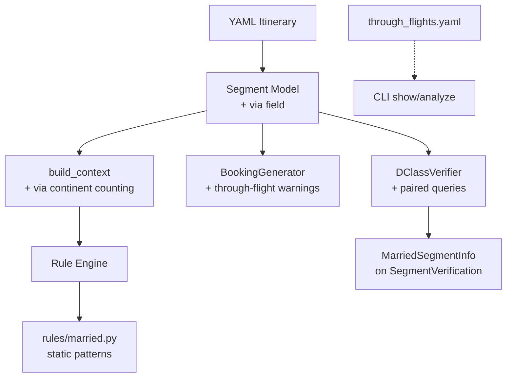

# Design: via-through-flights

## Overview

Extend the Segment model with an optional `via` field, add via-stop continent counting to the validator context builder, create a married segment rule file in the rules engine, add a through-flight reference data file, and enhance booking script + verify modules with married segment intelligence.

## Architecture



## Components

### Component A: Segment Model Extension
**Purpose**: Add `via` field to Segment for through-flight technical stops
**File**: `rtw/models.py`
**Responsibilities**:
- Accept `via` as `Optional[str | list[str]]` with `None` default
- Normalize to `list[str]` via Pydantic field_validator
- Uppercase airport codes
- Expose `has_via` property and `via_airports` normalized accessor

**Design**:
```python
class Segment(BaseModel):
    # ... existing fields ...
    via: Optional[str | list[str]] = None

    @field_validator("via", mode="before")
    @classmethod
    def normalize_via(cls, v):
        if v is None:
            return None
        if isinstance(v, str):
            return [v.upper()]
        return [x.upper() for x in v]

    @property
    def has_via(self) -> bool:
        return self.via is not None and len(self.via) > 0

    @property
    def via_airports(self) -> list[str]:
        return self.via or []
```

**Backward Compatibility**: `via` defaults to `None`. All existing YAML fixtures are unaffected. The `populate_by_name` model config already handles alias resolution.

### Component B: Validator Context Extension
**Purpose**: Count via-stop continents in `build_context()`
**File**: `rtw/validator.py`
**Responsibilities**:
- After resolving segment continents, iterate via airports and resolve their continents
- Add via-stop continents to `continents_visited` (not to `segments_per_continent`)
- Track via-stop continent sources in new `via_continents` and `via_continent_segments` context fields

**Design**:
```python
@dataclass
class ValidationContext:
    # ... existing fields ...
    # Via-stop continent visits {continent: [(seg_index, via_airport)]}
    via_continents: list[Continent] = field(default_factory=list)
    via_continent_segments: dict[Continent, list[tuple[int, str]]] = field(default_factory=dict)
```

**Extension to `build_context()`**:
After the main segment loop and before `_detect_implicit_continents()`:
```python
# Count via-stop continents
via_cont_segs: dict[Continent, list[tuple[int, str]]] = {}
for i, seg in enumerate(itinerary.segments):
    for via_apt in seg.via_airports:
        via_cont = get_continent(via_apt)
        if via_cont and via_cont not in seen_continents:
            seen_continents.append(via_cont)
        if via_cont:
            if via_cont not in via_cont_segs:
                via_cont_segs[via_cont] = []
            via_cont_segs[via_cont].append((i, via_apt))
ctx.via_continents = list(via_cont_segs.keys())
ctx.via_continent_segments = via_cont_segs
```

**Key rule**: Via-stop continents add to `continents_visited` (pricing) but NOT to `segments_per_continent` (segment limits). A through-flight remains one segment.

### Component C: Through-Flight Reference Data
**Purpose**: Static lookup table of known oneworld through-flights
**File**: `rtw/data/through_flights.yaml`
**Responsibilities**:
- Store carrier, flight number, origin, destination, via stops, and continents added
- Serve as reference for users; NOT auto-applied to segments

**Data Schema**:
```yaml
# Known oneworld through-flights with cross-continent via stops
# Reference data only — add `via:` to your YAML segment to trigger continent counting

through_flights:
  - carrier: QF
    flights: ["QF1", "QF2"]
    from: SYD
    to: LHR
    via: [SIN]
    continents_added: [Asia]
    notes: "Sydney-Singapore-London. SIN stop adds Asia to continent count."

  - carrier: BA
    flights: ["BA15", "BA16"]
    from: LHR
    to: SYD
    via: [SIN]
    continents_added: [Asia]
    notes: "London-Singapore-Sydney. Married segments at SIN — splitting requires reissue."

  - carrier: QR
    flights: ["QR920", "QR921"]
    from: DOH
    to: ADL
    via: [SIN]
    continents_added: [Asia]

  - carrier: QR
    flights: ["QR908", "QR909"]
    from: DOH
    to: MEL
    via: [SIN]
    continents_added: [Asia]

  # Same-continent via stops (no pricing impact)
  - carrier: QF
    flights: ["QF5", "QF6"]
    from: SYD
    to: FCO
    via: [PER]
    continents_added: []
    notes: "PER is SWP — no extra continent."

  - carrier: QF
    flights: ["QF3", "QF4"]
    from: SYD
    to: JFK
    via: [AKL]
    continents_added: []
    notes: "AKL is SWP — no extra continent."
```

### Component D: Married Segment Rules
**Purpose**: Detect married segment risk patterns via static analysis
**File**: `rtw/rules/married.py`
**Responsibilities**:
- CX hub-connection pattern: CX segments where HKG is a connection, not an endpoint
- QF standalone long-haul: QF intercontinental without domestic QF feeder
- Through-flight split warning: via-stop city has a stopover elsewhere in itinerary
- Registered via `@register_rule` decorator

**Design**:
```python
@register_rule
class MarriedSegmentRule:
    rule_id = "married_segments"
    rule_name = "Married Segment Risks"
    rule_reference = "Booking Advisory"

    def check(self, itinerary, context) -> list[RuleResult]:
        results = []
        results.extend(self._check_cx_hub(itinerary, context))
        results.extend(self._check_through_flight_split(itinerary))
        # Return INFO pass result if no issues found
        if not results:
            results.append(RuleResult(
                rule_id=self.rule_id, rule_name=self.rule_name,
                rule_reference=self.rule_reference,
                passed=True, message="No married segment risks detected."
            ))
        return results
```

**CX Hub Pattern**:
```python
def _check_cx_hub(self, itinerary, context):
    # Find CX segments where neither from nor to is HKG
    # but there IS a CX-HKG connection elsewhere in itinerary
    cx_has_hkg = any(
        s.carrier == "CX" and (s.from_airport == "HKG" or s.to_airport == "HKG")
        for s in itinerary.segments if s.is_flown
    )
    results = []
    for i, seg in enumerate(itinerary.segments):
        if seg.carrier == "CX" and seg.is_flown:
            if seg.from_airport != "HKG" and seg.to_airport != "HKG":
                results.append(RuleResult(
                    rule_id=self.rule_id, ...,
                    passed=False, severity=Severity.INFO,
                    message=f"CX {seg.from_airport}-{seg.to_airport}: D-class may only be "
                            f"available as married segment through HKG.",
                    segments_involved=[i],
                ))
    return results
```

**Through-Flight Split Detection**:
```python
def _check_through_flight_split(self, itinerary):
    # If a segment has via stops, check if any via-stop city also has
    # a stopover elsewhere — indicates user may want to split
    results = []
    stopover_cities = {s.to_airport for s in itinerary.segments if s.is_stopover}
    for i, seg in enumerate(itinerary.segments):
        for via_apt in seg.via_airports:
            if via_apt in stopover_cities:
                results.append(RuleResult(
                    rule_id=self.rule_id, ...,
                    passed=False, severity=Severity.INFO,
                    message=f"Through-flight via {via_apt} on segment {i+1} "
                            f"({seg.from_airport}-{seg.to_airport}): splitting to "
                            f"stopover at {via_apt} converts 1 segment to 2 + $125 reissue.",
                ))
    return results
```

### Component E: Booking Script Enhancement
**Purpose**: Add through-flight and married segment warnings to phone scripts
**File**: `rtw/booking.py`
**Responsibilities**:
- Detect segments with `via` field and add through-flight annotations
- Add GDS comment for through-flights
- Enhance existing married segment warning with carrier-specific context

**Design changes to `_segment_scripts()`**:
```python
# --- Through-flight via-stop annotation ---
if seg.has_via:
    via_str = ", ".join(seg.via_airports)
    from rtw.continents import get_continent
    via_conts = [get_continent(v) for v in seg.via_airports]
    cont_names = [c.value for c in via_conts if c]
    warnings.append(
        f"Through-flight via {via_str} — one segment, "
        f"counts {', '.join(cont_names)} for pricing."
    )
    instruction += f"\n  Via: {via_str} (through-flight, single segment)"
```

### Component F: ExpertFlyer Married Segment Detection
**Purpose**: Compare direct vs. connection availability to detect married segments
**File**: `rtw/verify/verifier.py` (extend `DClassVerifier`)
**Responsibilities**:
- For known hub carriers (CX/HKG, QR/DOH), run paired queries during verify
- Flag segments where D-class is only available via connection
- Add `married_segment` field to `SegmentVerification`

**Design**:
```python
# In DClassVerifier
_MARRIED_CHECK_HUBS = {
    "CX": "HKG",
    "QR": "DOH",
}

async def _check_married(self, seg, direct_result) -> Optional[str]:
    """Check if a segment shows married segment pattern."""
    hub = self._MARRIED_CHECK_HUBS.get(seg.carrier)
    if not hub or seg.origin == hub or seg.destination == hub:
        return None
    # Direct has no D-class; check via hub
    if direct_result.seats > 0:
        return None  # Direct available, no married concern
    # Would need connection query via hub — but ExpertFlyer
    # connection search already returns connecting flights in results
    # Check if any connection flights via hub have D-class
    connecting = [f for f in direct_result.flights if f.stops > 0 and f.seats > 0]
    if connecting:
        return f"D-class only via connection (likely married through {hub})"
    return None
```

**New field on SegmentVerification**:
```python
class SegmentVerification(BaseModel):
    # ... existing fields ...
    married_segment_note: Optional[str] = None
```

## Data Flow

1. User adds `via: SIN` to YAML segment
2. Pydantic normalizes to `via: ["SIN"]` on Segment model
3. `build_context()` resolves SIN -> Asia, adds to `continents_visited`
4. Rules engine runs `MarriedSegmentRule` for static pattern detection
5. `rtw verify` runs ExpertFlyer queries; paired queries detect married patterns
6. `BookingGenerator` adds through-flight annotations to phone script
7. `rtw show` displays via-stop info alongside segment details

## Technical Decisions

| Decision | Options | Choice | Rationale |
|----------|---------|--------|-----------|
| Via field type | `str`, `list[str]`, `str \| list[str]` | `str \| list[str]` | Convenience: single string for common case, list for rare multi-stop |
| Via normalization | Runtime helper, Pydantic validator | Pydantic field_validator | Follows existing pattern (`uppercase_airports`); normalized at parse time |
| Via continent tracking | Merge into implicit_continents, separate field | Separate `via_continents` field | Different source; keeps implicit EU_ME<->SWP rule distinct from explicit via |
| Married rule location | `booking.py`, `rules/married.py` | `rules/married.py` | Follows rule engine pattern; discoverable; testable independently |
| Through-flight data format | Python dict, JSON, YAML | YAML | Consistent with existing data files in `rtw/data/` |
| ExpertFlyer married check | Opt-in flag, always-on | Always-on | User decision: always check during verify; rate limiting handles load |

## File Structure

| File | Action | Purpose |
|------|--------|---------|
| `rtw/models.py` | Modify | Add `via` field + validator + properties to Segment |
| `rtw/validator.py` | Modify | Add via-continent fields to ValidationContext; extend `build_context()` |
| `rtw/data/through_flights.yaml` | Create | Known through-flight reference data |
| `rtw/rules/married.py` | Create | Married segment static pattern rules |
| `rtw/booking.py` | Modify | Through-flight and married segment warnings in phone scripts |
| `rtw/verify/models.py` | Modify | Add `married_segment_note` to SegmentVerification |
| `rtw/verify/verifier.py` | Modify | Paired query logic for married segment detection |
| `rtw/validator.py` | Modify | Register married rule module in `_discover_rules()` |
| `rtw/cli.py` | Modify | Show via-stop info in `show` and `analyze` output |
| `tests/test_models.py` | Modify | Tests for via field normalization |
| `tests/test_validator.py` | Modify | Tests for via-continent counting |
| `tests/test_rules/test_married.py` | Create | Tests for married segment rules |
| `tests/test_booking.py` | Modify | Tests for through-flight booking warnings |
| `tests/fixtures/via_through_flight.yaml` | Create | Test fixture with via stops |
| `tests/test_integration.py` | Modify | Integration test with through-flight itinerary |

## Error Handling

| Error | Handling | User Impact |
|-------|----------|-------------|
| Invalid via airport code | Pydantic validation error at parse time | Clear error: "via airport must be 3-letter IATA code" |
| Unknown via airport continent | `get_continent()` returns None; skip (no continent added) | Silent skip; airport still shown in output but no continent counted |
| ExpertFlyer paired query timeout | Catch timeout, return direct result only | Married detection skipped; direct availability still shown |
| ExpertFlyer rate limit hit during paired query | Skip paired query, use existing direct result | Log warning; married detection deferred |
| Through-flight YAML parse error | Fail-fast on load (same as other data files) | Startup error with clear message |

## Existing Patterns to Follow

- **Field validator pattern**: `rtw/models.py:145-158` — `@field_validator` with `mode="before"`, `@classmethod`, uppercase normalization
- **Optional field pattern**: `rtw/models.py:136-141` — `Optional[str] = Field(default=None)` with model_config `populate_by_name`
- **Rule registration**: `rtw/rules/geography.py:66` — `@register_rule` decorator on class with `rule_id`, `rule_name`, `rule_reference`, `check()` method
- **Rule discovery**: `rtw/validator.py:184-195` — explicit import in `_discover_rules()`
- **Data loading**: `rtw/continents.py:15-16` — `yaml.safe_load()` from `_DATA_DIR`
- **Context dataclass**: `rtw/validator.py:17-48` — `@dataclass` with `field(default_factory=list/dict)`
- **Booking warnings**: `rtw/booking.py:179-196` — append to `warnings: list[str]` in `_segment_scripts()`
- **Verify models**: `rtw/verify/models.py:127-136` — `SegmentVerification` with optional fields
